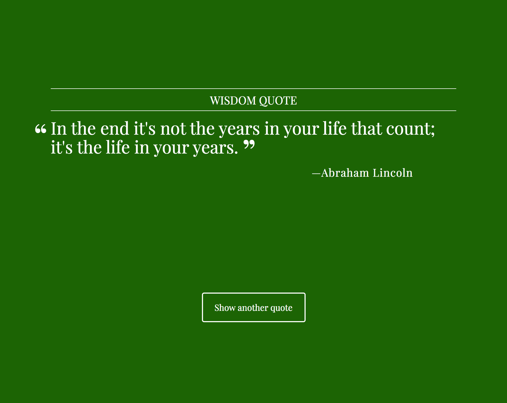

# Random Quote Generator app based on PHP, HTML & CSS
### PHP Team Treehouse TechDegree project #1

- [What the app does](#what-the-app-does)
- [Tech used](#tech-used)
- [Folder & file structure](#folder--file-structure)

## What the app does
- This app randomly shows quotes, their source and category. Optionally it also shows their year & citation.
- The app refreshes every 10 seconds to display a new quote. Or the button can be used to show a new quote.
- The background color is randomly calculated.
- A font color is then chosen (white or black), which has the best contrast with the background color.

## Tech used
#### In this app the following main concepts & languages are applied:
PHP | conditionals | functions | arrays (associative & multidimensional) | HTML | CSS

## Folder & file structure
#### The most important folders & files within this project:

      .
      ├── css                         # contains the css files                 
      ├── inc                         # contains the functions & quotes files
      └── index.php                   # main screen of the app, which displays the quotes
